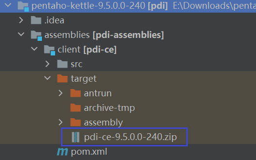
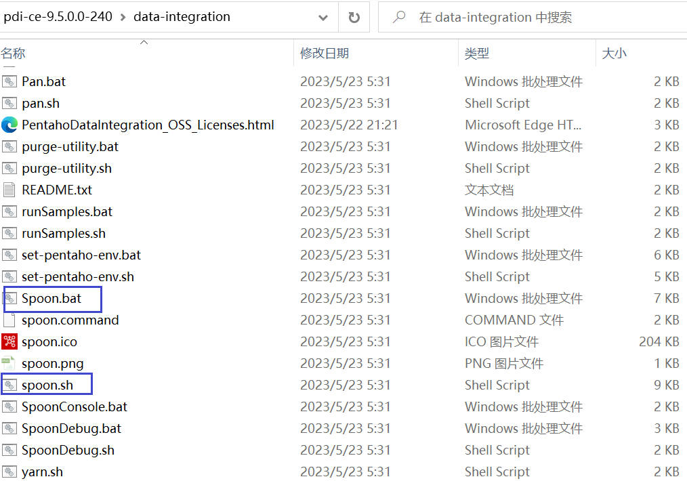
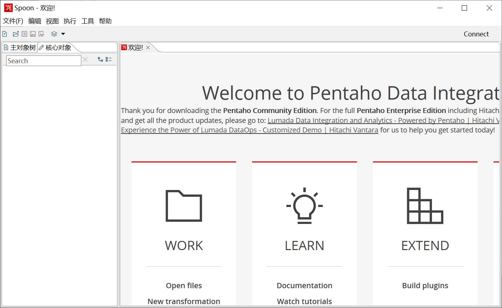
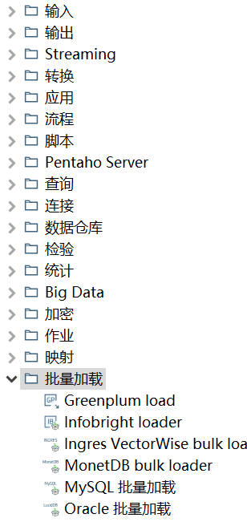
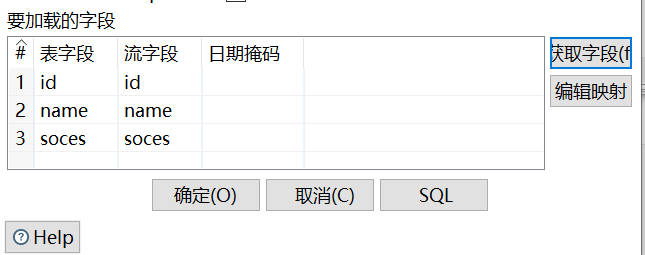
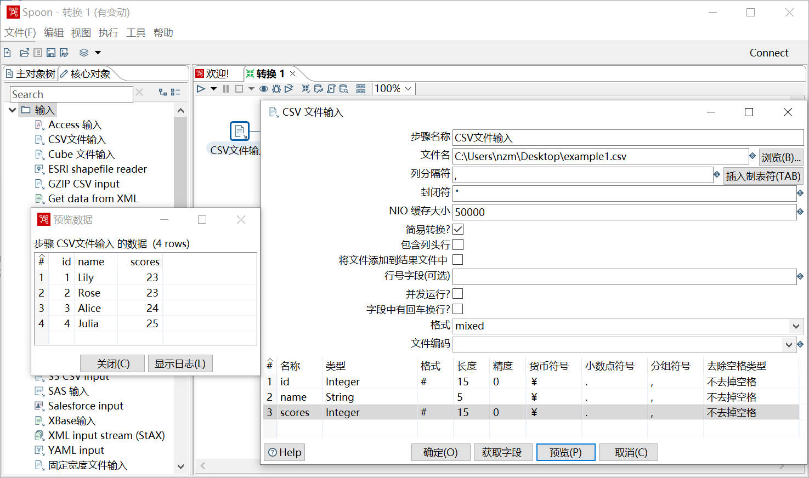
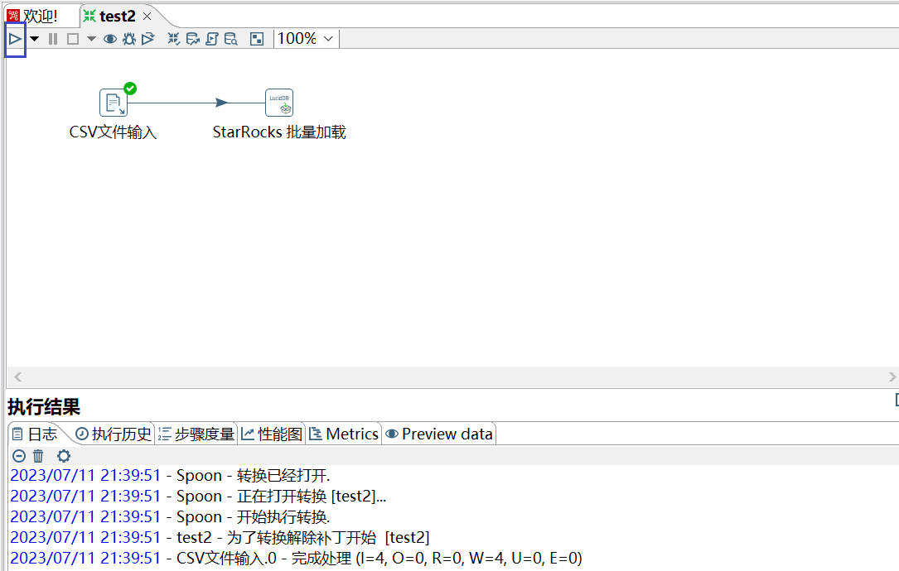

# StarRocks-Kettle-Connector-plugin Readme

# Why

目前，StarRocks兼容并支持DataX、Flink以及Spark这三种高效的数据处理框架，从而实现数据的有效写入到StarRocks中。然而，需要注意的是，这三种框架的操作均基于命令行或代码，这可能对非技术人员构成一定的挑战。因此，为了增加易用性并优化用户体验，我们正在扩展StarRocks的Kettle Connector，以实现直观的、可视化的数据导入操作，使得无论技术背景如何，用户都能够方便快捷地进行数据导入。

Kettle是一个流行的ETL工具，它提供了一种可视化的图形界面，用户可以通过拖拽组件、配置参数等方式来构建数据处理流程。这种直观的操作方式大大简化了数据处理和导入的过程，使得用户可以更加便捷地处理数据。此外，Kettle还提供了丰富的操作组件库，用户可以根据自己的需求选择合适的组件，实现各种复杂的数据处理任务。

通过扩展StarRocks对Kettle的连接功能，用户不仅可以实现更方便的数据导入，还可以利用Kettle的操作组件库，提供更便捷、更灵活的数据处理和导入方式。用户可以更加方便地从各种数据源读取数据，然后通过Kettle的数据处理流程，将处理后的数据导入到StarRocks。

# What

StarRocks Kettle Connector实现了Kettle的一个插件，它用于在StarRocks和Kettle之间建立连接，以实现众多数据源数据向StarRocks导入和ETL（Extract, Transform, Load）功能。通过此插件，可以将Kettle的强大数据处理和转换功能与StarRocks的高性能数据存储和分析能力相结合，从而实现更加灵活和高效的数据处理流程。

使用StarRocks Kettle Connector的场景包括：

1. 数据集成：当需要从不同的数据源中抽取数据，进行数据清洗和转换，最后将数据加载到StarRocks中进行分析和查询时，可以使用此功能来实现数据集成和ETL。
2. 复杂数据处理：当数据处理流程比较复杂，需要多个数据转换步骤和数据源连接时，可以利用Kettle的可视化界面来设计和配置ETL工作流程，最后将数据记载到StarRocks，提高开发效率和灵活性。
3. 数据转换和整合：当需要对原始数据进行复杂的转换和整合，以满足特定的数据分析和查询需求时，可以使用Kettle的强大数据转换功能来实现。

通过StarRocks Kettle Connector，用户可以获得以下好处：

1. 便捷性：利用Kettle的可视化界面，可以以图形化方式设计和配置复杂的ETL工作流程，简化了从不同数据源向StarRocks的数据加载过程，降低学习成本。
2. 灵活性：通过与Kettle的连接，扩展了StarRocks的数据处理能力，使得用户可以根据自己的需求选择适合的工具和方式来进行数据处理。
3. 高性能：StarRocks作为一个高性能的数据存储和分析引擎，与Kettle的连接可以将高效的数据加载与复杂的数据转换和整合相结合，从而提高数据处理的性能。

# How

## 安装

首先，你需要从Github上下载[Kettle源码](https://github.com/pentaho/pentaho-kettle)，并根据Readme构建Kettle项目。Kettle项目使用的是Maven框架，需要如下准备：

- Maven,version3+
- Java JDK 11
- 使用该[settings.xml](https://raw.githubusercontent.com/pentaho/maven-parent-poms/master/maven-support-files/settings.xml) 在/.m2 文件夹

最后生成Kettle应用压缩包：<源码目录>\assemblies\pdi-ce\target\pdi-ce-x.x.x.x-xxx.zip



## 启动

解压上一步得到的pdi-ce-x.x.x.x-xxx.zip压缩包，得到Kettle应用data-integration无需安装。data-integration文件包含如下启动文件：



通过Spoon.bat(Windows)或Spoon.sh(Linux)启动Kettle图形界面，如下显示证明启动成功。



## 导入StarRocks Kettle Connector 插件

- 下载StarRocks Kettle Connector的插件源码，将其进行打包编译得到StarRocks-Kettle-Connector-plugin.jar包。
- 将StarRocks-Kettle-Connector-plugin.jar包放在data-integration\plugins文件目录下。
- 启动Spoon，转换/批量加载中即可看到StarRocks Kettle Connector插件。



根据插件ui提示输入StarRocks连接配置信息。

```Java
'scan-url'='fe_ip1:8030,fe_ip2:8030,fe_ip3:8030'
'jdbc-url'='jdbc:mysql://fe_ip:9030'
'username'='root'
'password'=''
'database-name'='kettle_test'
'table-name'='kettle_test'
// The format of the data to be loaded. The value can be CSV or JSON. 
// The default is CSV. 
'format'='CSV'
// Starting from version 2.4, partial column updates in the primary key model are supported. You can specify the columns to be updated through the following two attributes, 
// and you need to explicitly add the '__op' column at the end of 'partial-update-columns','k1,k2,k3'.
'partial-update'='true'
'partial-update-columns'='k1,k2,k3'
// StarRocks supports two types of data delivery semantics, "at-least-once" and "exactly-once".
// "Exactly-once" is implemented through the Stream Load transaction interface using transactions and checkpoints.
// "At-least-once" achieves data accuracy through a retry mechanism, 
// where if the system doesn't receive a confirmation message after data processing, it will resend the data.
// The default is exactly-once.
'semantic'='exactly-once'
// The import parameters of Stream Load, using JSON format for import.
'loadProps'={}
// The maximum size of data that can be loaded into StarRocks at a time. 
// Valid values: 64 MB to 10 GB. 
'maxbytes'=94371840
// The maximum number of rows that can be loaded into StarRocks at one time.
// Valid values: 64000 to 5000000.
'maxrows'=500000
// Timeout period for connecting to the load-url. 
// Valid values: 100 to 60000
'connect-timeout'=1000
// Stream Load timeout period, in seconds.
'timeout'=600
```

自动获取需要导入的数据库的字段信息，该字段信息的数据类型是与上游中导入的数据类型对应，在向StarRocks导入数时会实现数类型的映射，如需更改顺序则直接在其上更改。



## StarRocks-Kettle数据类型对应关系

### Kettle数据类型

1. **String**：存储字符串或文本信息。
2. **Date**：存储日期信息。日期被存储为从1970-01-01 00:00:00.000 GMT开始的毫秒数。因此，可以保存任何日期和时间，从公元前至公元后。日期类型的默认掩码为yyyy/MM/dd HH:mm:ss.SSS。
3. **Boolean**：存储逻辑值，即True/False。
4. **Integer**：存储整数值。所有整数都被当作长整型(Long)处理，范围在-9223372036854775808到9223372036854775807之间。
5. **Number**：用于存储浮点数。这是一种双精度浮点类型，具有至少15位的精度。
6. **BigNumber**：用于存储任意精度的数字，适合用于精确的科学计算。
7. **Binary**：用于存储二进制对象。
8. **Timestamp**：这是一个扩展的日期类型，允许更好地在数据库中处理日期和时间的组合。
9. **Internet Address**：存储Internet地址，主要是为了验证这些地址的正确性。

### StarRocks数据类型以及与Kettle对应

| Kettle           | StarRocks                                                    |
| ---------------- | ------------------------------------------------------------ |
| String           | CHAR、STRING、VARCHAR                                        |
| Date             | DATE、DATETIME                                               |
| Boolean          | BOOLEAN                                                      |
| Integer          | TINYINT 、SMALLINT 、INT 、BIGINT                            |
| Number           | FLOAT 、DOUBLE                                               |
| BigNumber        | LARGEINT、[DECIMAL](https://docs.starrocks.io/zh-cn/latest/sql-reference/sql-statements/data-types/DECIMAL)、DOUBLE |
| Binary           | BINARY                                                       |
| Timestamp        |                                                              |
| Internet Address | STRING                                                       |
| serializable     |                                                              |

**serializable、Timestamp：StarRocks中无与之相对应的数据类型**

## 使用示例

### 准备工作

在本地文件系统中创建一个 CSV 格式的数据文件 `example1.csv`。文件一共包含三列，分别代表用户 ID、用户姓名和用户得分，如下所示：

```Plain
1,Lily,23
2,Rose,23
3,Alice,24
4,Julia,25
```

### 使用Kettle读取csv文件数据



### 向StarRocks中导入数据

1. 配置StarRocks数据导入参数。(最终开发会实现如上ui输入框的格式来进行参数的输入)

```Java
'scan-url'='127.0.0.1:8030'
'jdbc-url'='jdbc:mysql://127.0.0.1:9030'
'username'='root'
'password'=''
'database-name'='kettle_test'
'table-name'='test_table'
'format'='CSV'
'semantic'='exactly-once'
'loadProps'={}
```

1. 点击开始按钮执行导入作业



1. 查询导入结果

```SQL
MySQL [kettle_test]> select * from test_table;
+------+-----------+-------+
| id   | name      | scores|
+------+-----------+-------+
|    1 | Lily      |   23  |
|    2 | Rose      |   23  |
|    3 | Alice     |   24  |
|    4 | Julia     |   25  |
+------+-----------+-------+
4 rows in set (0.02 sec)
```

# Limitation

- 不支持导入某一列为 JSON 的 CSV 文件的数据。
- 不支持at-least-once和exactly-once导入方式。
